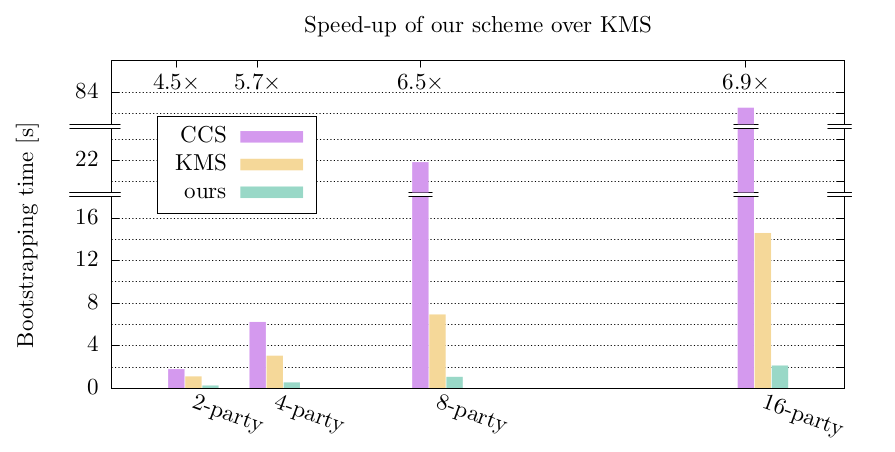

# Multi-Key Homomorphic Encryption from TFHE

This repository provides a highly experimental proof-of-concept implementation of a multi-key TFHE scheme, referred to as AKÖ, which we propose in [1].

The code is written on top of another PoC implementation of a multi-key TFHE scheme by Kwak et al. [https://github.com/SNUPrivacy/MKTFHE](https://github.com/SNUPrivacy/MKTFHE), which is described in [3], here referred to as KMS.
In that repository, they also implement another scheme by Chen et al. [2], referred to as CCS.

## Highlights

Our AKÖ scheme is mostly suitable for a setup with a fixed set of parties, however, at a slight pre-computation overhead, it allows for a party to join the comptation later.
In the basic scenario, AKÖ offers the best performance, compared to CCS and KMS. On top, AKÖ is accompanied by parameter sets that led to zero errors in our extensive experiments, unlike CCS or KMS.

## Running the code

Since this is only a PoC implementation, examples of code to be executed out of the box are fairly limited:

 1. a DEMO can be found in `multikey_3gen.jl`,
 2. experiments were performed using the code in the `measurements` folder; for more details, we refer to the paper.

# Authors

Yavuz AKIN, Jakub KLEMSA, Melek ÖNEN.

# References

[1] A Practical TFHE-Based Multi-Key Homomorphic Encryption with Linear Complexity and Low Noise Growth. Jakub Klemsa, Melek Önen, Yavuz Akın. [https://ia.cr/2023/065](https://ia.cr/2023/065)

[2] Multi-Key Homomophic Encryption from TFHE. Hao Chen, Ilaria Chillotti, Yongsoo Song. [https://eprint.iacr.org/2019/116](https://eprint.iacr.org/2019/116)

[2] Towards Practical Multi-key TFHE: Parallelizable, Key-Compatible, Quasi-linear Complexity. Hyesun Kwak, Seonhong Min, Yongsoo Song. [https://eprint.iacr.org/2022/1460](https://eprint.iacr.org/2022/1460)
